# DrQ Learning Curves

```

```python
colors = ['#23aaff', '#ff7575', '#66c56c', '#f4b247', "brown", "gray"]
loader = ML_Logger(prefix="model-free/model-free/001_baselines/train")
```

Plotting the learning curve at various regularization strength

| **ball_in_cup-catch** | **cartpole-swingup** | **cheetah-run** | **finger-spin** |
|:---------------------:|:--------------------:|:---------------:|:---------------:|
| 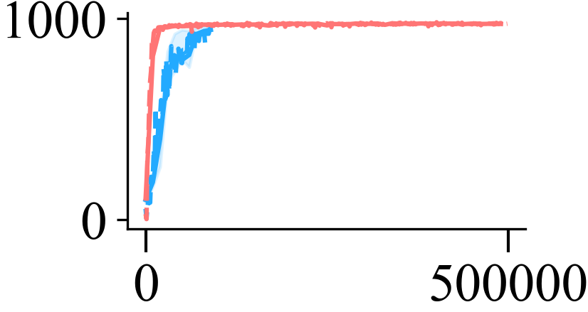 | 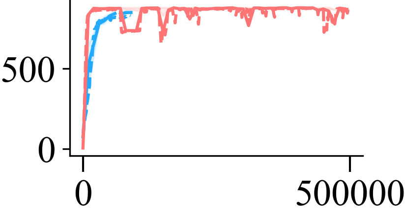 | 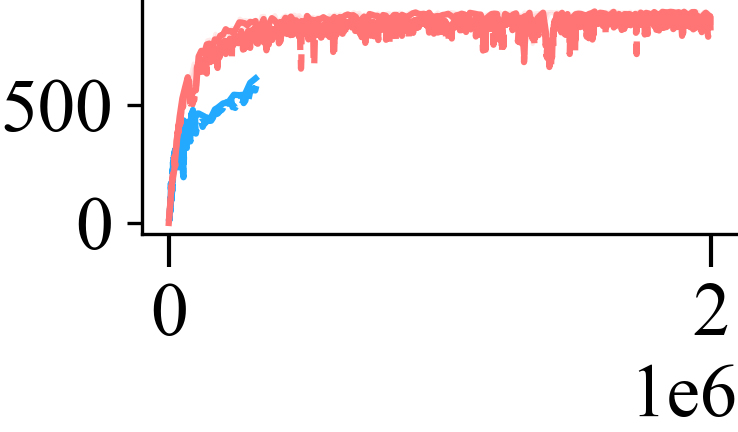 | 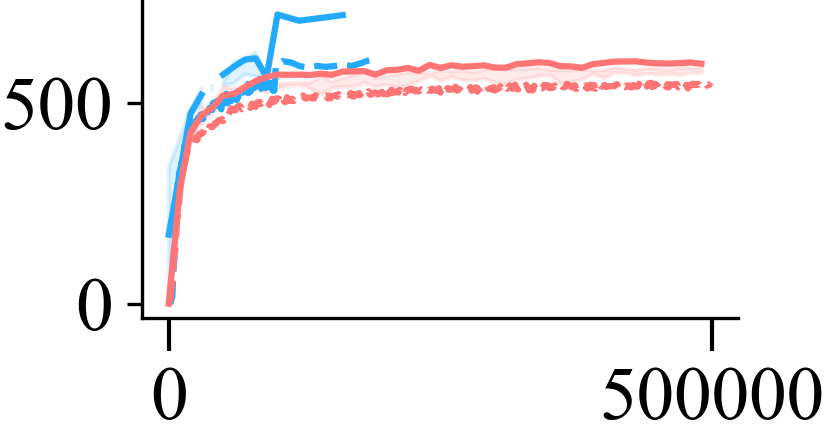 |
| **reacher-easy** | **walker-walk** | **cartpole-balance** | **cartpole-balance_sparse** |
| 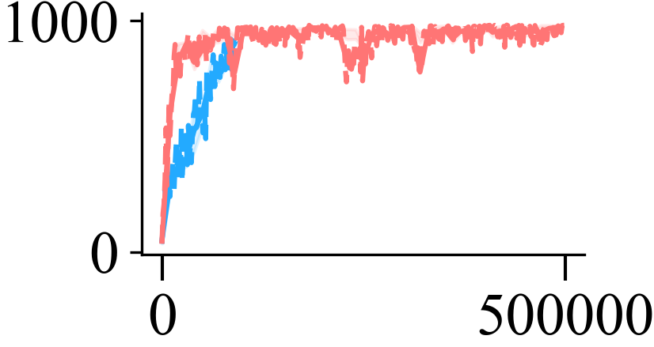 | 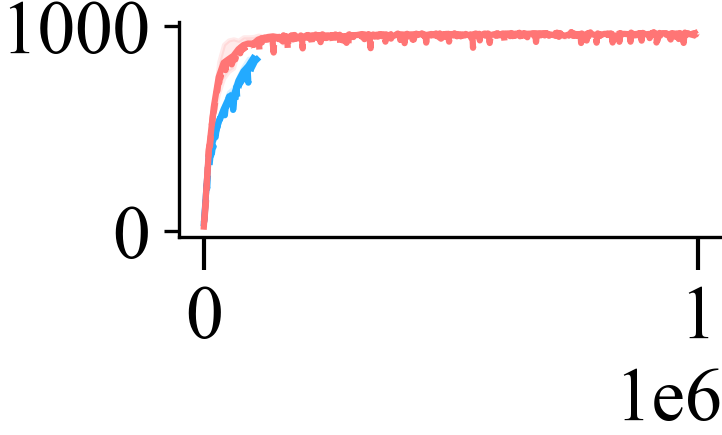 | 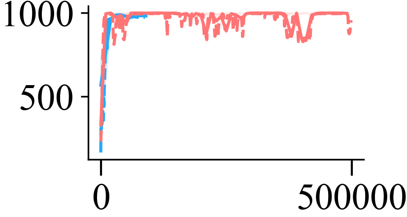 | 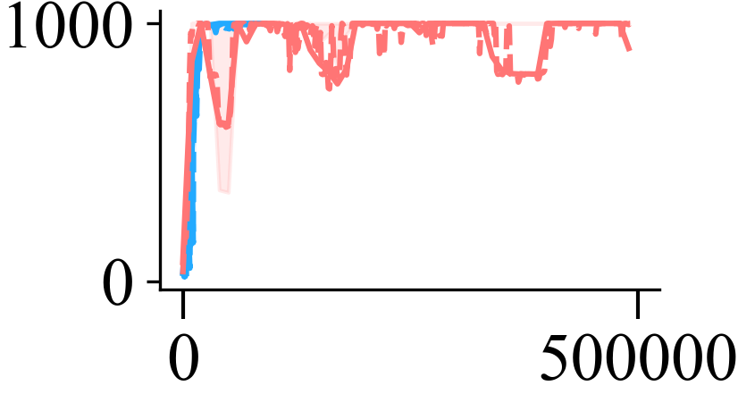 |
| **cartpole-swingup_sparse** | **hopper-hop** | **hopper-stand** | **pendulum-swingup** |
| 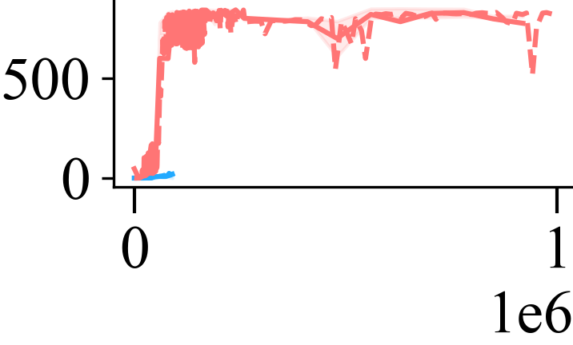 | 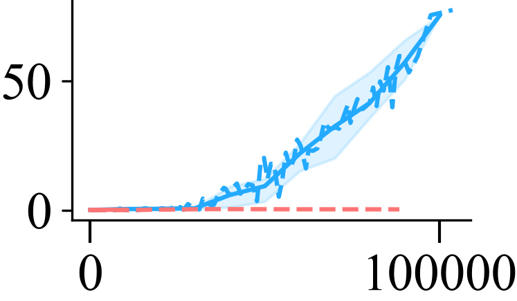 | 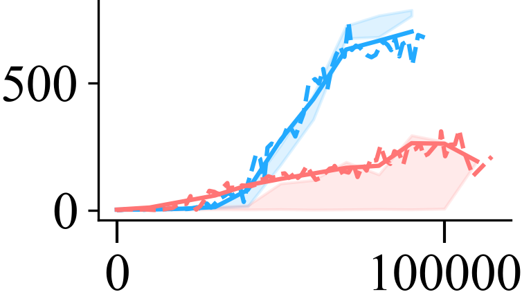 | 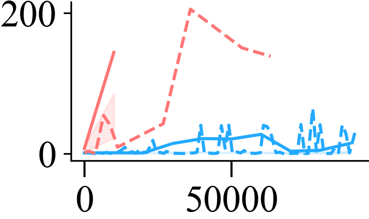 |
| **reacher-hard** | **walker-run** | **walker-stand** | **walker-stand** |
| 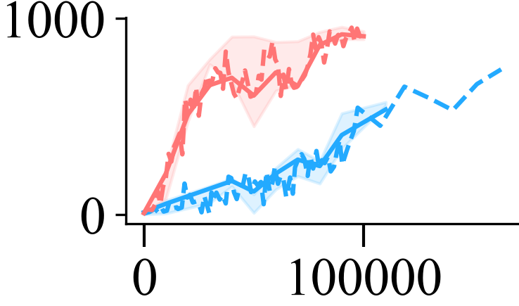 | 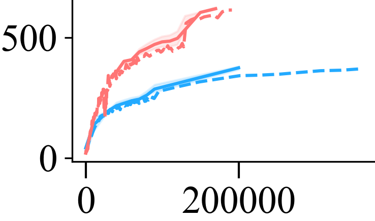 | 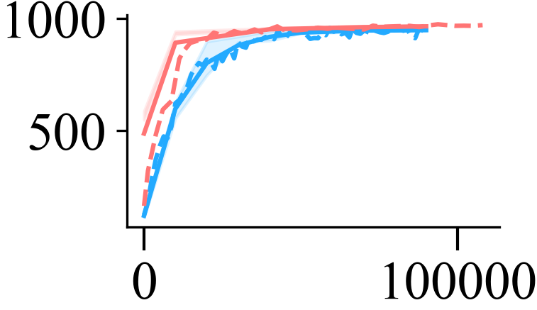 | 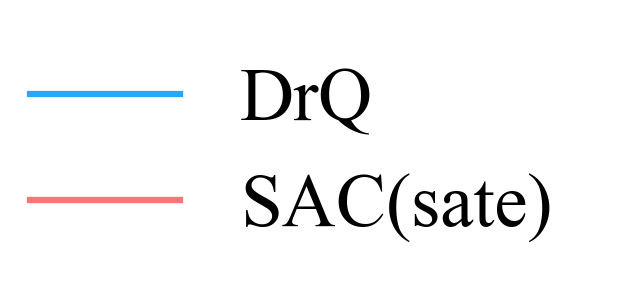 |

```
ball_in_cup-catch/drq/**/metrics.pkl 90000
ball_in_cup-catch/drq-state/**/metrics.pkl 490000.0
cartpole-swingup/drq/**/metrics.pkl 90000.0
cartpole-swingup/drq-state/**/metrics.pkl 490000.0
cheetah-run/drq/**/metrics.pkl 320000.0
cheetah-run/drq-state/**/metrics.pkl 1990000.0
finger-spin/drq/**/metrics.pkl 160000.0
finger-spin/drq-state/**/metrics.pkl 490000.0
reacher-easy/drq/**/metrics.pkl 90000
reacher-easy/drq-state/**/metrics.pkl 490000.0
walker-walk/drq/**/metrics.pkl 100000
walker-walk/drq-state/**/metrics.pkl 990000.0
cartpole-balance/drq/**/metrics.pkl 90000.0
cartpole-balance/drq-state/**/metrics.pkl 490000.0
cartpole-balance_sparse/drq/**/metrics.pkl 90000.0
cartpole-balance_sparse/drq-state/**/metrics.pkl 490000.0
cartpole-swingup_sparse/drq/**/metrics.pkl 90000
cartpole-swingup_sparse/drq-state/**/metrics.pkl 920000.0
hopper-hop/drq/**/metrics.pkl 100000.0
hopper-hop/drq-state/**/metrics.pkl 10000
hopper-stand/drq/**/metrics.pkl 90000
hopper-stand/drq-state/**/metrics.pkl 110000
pendulum-swingup/drq/**/metrics.pkl 90000
pendulum-swingup/drq-state/**/metrics.pkl 10000
reacher-hard/drq/**/metrics.pkl 110000
reacher-hard/drq-state/**/metrics.pkl 100000
walker-run/drq/**/metrics.pkl 200000.0
walker-run/drq-state/**/metrics.pkl 170000.0
walker-stand/drq/**/metrics.pkl 90000
walker-stand/drq-state/**/metrics.pkl 90000
```
